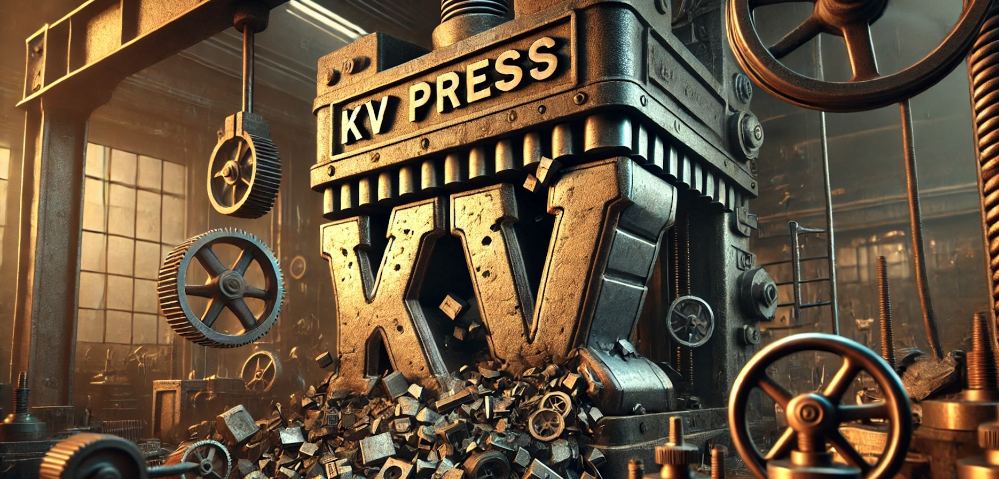
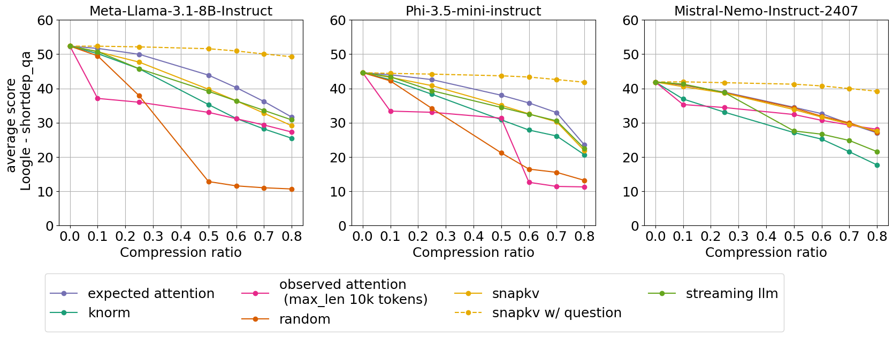

[](https://badge.fury.io/py/kvpress)
[](https://opensource.org/licenses/Apache2.0)



Deploying long-context LLMs is costly due to the linear growth of the key-value (KV) cache in transformer models. For example, handling 1M tokens with Llama 3.1-70B in float16 requires up to 330GB of memory. This repository implements multiple KV cache pruning methods and benchmarks using [🤗 transformers](https://huggingface.co/docs/transformers/en/index), aiming to simplify the development of new methods for researchers and developers in this field.

## Installation

```bash
pip install kvpress
```

We recommend using [flash attention](https://github.com/Dao-AILab/flash-attention/) if possible:
```bash
pip install flash-attn --no-build-isolation
```

## Usage

This repository provides a set of "presses" that compress the KV cache by pruning the least important key-value pairs in each attention head. A press is only applied during the pre-filling phase and is associated with a `compression_ratio` parameter that controls the amount of pruning. The easiest way to use a press is through our custom `KVPressTextGenerationPipeline` that is automatically registered as a transformers pipeline with the name "kv-press-text-generation" when kvpress is imported. It handles chat templates and tokenization for you:


```python
from kvpress import ExpectedAttentionPress
from transformers import pipeline

device = "cuda:0"
model= "microsoft/Phi-3.5-mini-instruct"
pipe = pipeline("kv-press-text-generation", model=model, device=device, torch_dtype="auto", model_kwargs={"attn_implementation":"flash_attention_2"})

context = "A very long text you want to compress once and for all"
question = "\nA question about the compressed context" # optional
    
press = ExpectedAttentionPress(compression_ratio=0.4)
answer = pipe(context, question=question, press=press)["answer"]
```

In the snippet above, the compression is only applied on the context tokens so that you can evaluate the compression for different questions. Check the [Wikipedia notebook demo](notebooks/wikipedia_demo.ipynb) for a more detailed example.

> [!IMPORTANT]  
> We focus on pruning during the pre-filling phase as the KV cache becomes a bottleneck for long-context sequence (100k - 1M tokens) which are essentially long context prompts. This would typically apply to improving prompt caching systems.

> [!NOTE]  
> To use the `ObservedAttentionPress`, use `model_kwargs={"attn_implementation":"eager"}` in order to materialize the attention weights (this method is not compatible with flash attention).

## Contributing with a new press

We welcome contributions! If you want to implement a new press, open an issue or a pull request. Refer to the [FAQ](#faq) for more information on how presses work and how to create new ones or check the [new_press.ipynb](notebooks/new_press.ipynb) notebook for a step-by-step guide.

## Available presses

We provide the following presses associated with the following scores:
- `RandomPress`: random score
- `KnormPress`: inverse norm of the key ([paper](https://arxiv.org/abs/2406.11430))
- `ObservedAttentionPress`: average attention weight observed during in pre-filling phase (similar to [H2O](https://arxiv.org/abs/2306.14048) or [TOVA](https://arxiv.org/abs/2401.06104))
- `SnapKVPress`: average attention weight of the last 64 queries ([paper](https://arxiv.org/abs/2404.14469))
- `ExpectedAttentionPress` (ours): expected attention weight during the generation phase  (see [this notebook](notebooks/expected_attention.ipynb))
- `StreamingLLMPress`: keep only the first and last tokens ([paper](https://arxiv.org/abs/2309.17453))

## Evaluation

We provide a simple CLI to evaluate the performance of the different presses on several long-context datasets. 

_Average performance on the RULER dataset with 4k context length and Loogle Short Dependency QA task for 3 models and 7 presses_



Please refer to the [evaluation](evaluation/README.md) directory for more details and results.

## FAQ

<details><summary> 

### Which models are supported ? 
</summary>

Some presses depend on the model architecture (_e.g._ `ExpectedAttentionPress` and `SnapKVPress`) hence they might not work with all models. We tested support for `LlamaForCausalLM`, `MistralForCausalLM`, `Phi3ForCausalLM` and `Qwen2ForCausalLM` but many other models might be supported out of the box because their implementation is often similar in transformers.
</details>


<details> <summary> 

### What are the memory and throughput gains ?
</summary>

Memory usage should be reduced by around `compression_ratio * kv_cache_size`. As the KV cache is smaller, decoding should also be faster. You can measure peak memory usage gain and total time gain using [this notebook](notebooks/speed_and_memory.ipynb).
</details>


<details> <summary> 

### How does a press work ? </summary>

A press registers a forward hook to each attention layer during the pre-filling phase:
1. Immediately after the forward pass, the hook is called, and it computes a score for each key-value pair using the `press.score` method
2. The key-value pairs with the lowest scores are then removed based on the `compression_ratio` parameter

```python
import torch
from transformers import AutoModelForCausalLM
from kvpress import KnormPress

device = "cuda:0"
ckpt = "meta-llama/Meta-Llama-3.1-8B-Instruct"
model = AutoModelForCausalLM.from_pretrained(ckpt).to(device)
press = KnormPress(compression_ratio=0.4)

inputs = model.dummy_inputs["input_ids"].to(device)

with torch.no_grad():
    print(model(inputs).past_key_values[0][0].shape)
    # torch.Size([3, 8, 5, 128])
    
with torch.no_grad(), press(model):
    print(model(inputs).past_key_values[0][0].shape)
    # torch.Size([3, 8, 3, 128])
```
</details>

<details><summary> 

### Why not using model.generate ? 
</summary>

In fact you can use `model.generate` with a press by using the press as a context manager:

```python
with press(model):
    outputs = model.generate(inputs)
```

However, the `generate` method does not allow to exclude the question from the compression, which would artificially favors methods such as SnapKV. Ideally, we want a compression method that works whatever comes after the context (_e.g._ for use cases such as chat or document question answering). Finally the `generate` method does not allow to provide generation for multiple questions at once.

</details>

<details><summary> 

### How to create a new press ?
</summary>

All presses are stored in the `presses` directory. The easiest way to create a new press is to create a class that inherits from `BasePress` and implement a `score` method that computes the score for each key-value pair (see `knorm_press.py` for a simple example). Check the notebook [new_press.ipynb](notebooks/new_press.ipynb) for a step-by-step guide.

Before opening a pull request with a new press, make sure to register it in the `__init__.py` file of repository and to add it in [test_presses.py](tests/presses/test_presses.py).

</details>

<details><summary> 

### Can I change the compression ratio from one layer to another ?
</summary>

We provide an experimental feature, which only works with flash attention:
```python
from kvpress import apply_per_layer_compression
# compression_ratios should have the same length as the number of layers
press = apply_per_layer_compression(press, compression_ratios=[...])
```

Check the [demo notebook](notebooks/per_layer_compression_demo.ipynb) for more details.
</details>

<details><summary> 

### Is quantization supported ?
</summary>

We don't support quantization of the KV cache yet. Quantization can achieve up to 4x compression moving from (b)float16 to int4 and we believe it is orthogonal to the KV cache pruning strategies proposed in this repository.

</details>
